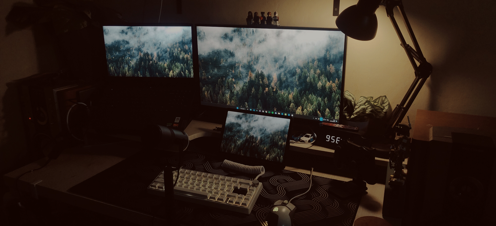

<h1 align="center">
      

### A Student Developer on a Journey    
    
</h1>

    

    
🎓 <strong>Student at</strong>: <strong>SMK TI Global Denpasar</strong>

      
💻 <strong>Passionate about</strong>: Coding with <strong>Tailwind</strong> and <strong>Bootstrap</strong>

      
🎨 <strong>UI/UX Design</strong> enthusiast creating user-friendly interfaces

      
🌿 <strong>Currently learning</strong>: <strong>Vue</strong> for scalable web apps

      
🔧 <strong>Exploring</strong>: <strong>PHP</strong> and <strong>Laravel</strong> for back-end development

      
📊 <strong>Excited about</strong>: <strong>Data Science</strong>, merging coding with data analysis and machine learning

      
🤖 <strong>Hobby</strong>: Passionate about <strong>Robotics</strong>

---

### 💻 Tools & Technologies
 

 
 

---

### 🔥Stats🔥

 

  
  

### ⚔️ My Activity

